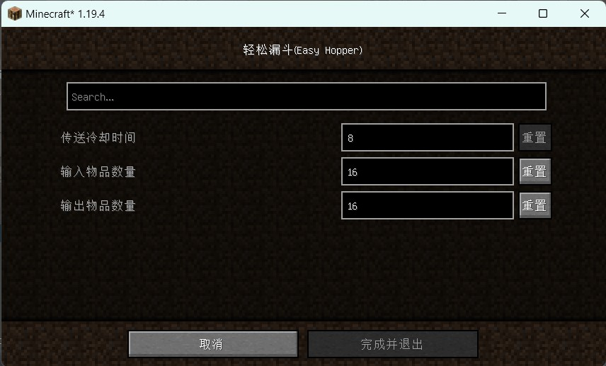

## EasyHopper

此mod允许你在设置中修改漏斗速度.包括冷却时间和一次传入或传出的物品数量,以增大传输速度.在漏斗太多,则可以增大两次传输的时间间隔,并增大一次传输的数量,以减小卡顿.

## 依赖

``minecraft 1.19.4``

``fabric >=0.14.19``

``modmenu >=6.2.1``

其中前置mod``modmenu``可在以下链接下载

[https://modrinth.com/mod/modmenu/versions](https://modrinth.com/mod/modmenu/versions)

仅在客户端上测试通过,服务器不保证有效

## 下载

[发行版](https://gitee.com/dearxuan/EasyHopper/releases/)

## 注意

修改漏斗速度会对部分红石电路产生影响,以下是已发现的问题.

### 漏斗分类

漏斗会在一次传输任务中输出多个物品,如果你使用红石电路来实现漏斗分类,一般建议将输入或输出数量限制在``32``以下.

如果使用了水流分类,则不建议增大冷却时间,但是你可以改用漏斗链分类,并增大冷却时间和输入输出数量来减少卡顿.坏处是传输时间会变长.

以下是使用漏斗分类时的推荐设置.这可能会导致漏斗内物品数量更新

| 冷却时间 | 输入输出数量 |
|------|--------|
| 8    | ≤32    |
| 4    | ≤16    |
| 2    | ≤8     |

### 漏斗计时器

如果使用两个相向漏斗计时时,则需要根据你的具体设置,自行计算漏斗内物品数量.
