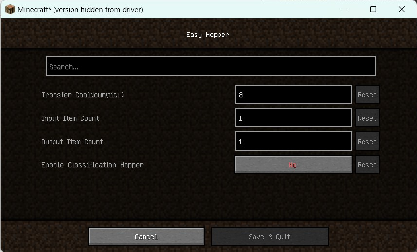

## Easy Hopper

This mod is used to optimize the performance of hoppers and provides a classification function without using new blocks.

## Dependencies

``modmenu``(Only Client)

**Important**:

If this mod is installed on a client, not a server, it is recommended to install ``modmenu``, or you will not see the configuration screen.

## Download

[Get It From CurseForge](https://www.curseforge.com/minecraft/mc-mods/easyhopper)

## Features

### Cooldown

After each input or output, the hopper will enter a cooldown period. The original cooldown is 8 ticks (20 ticks per second). This mod provides the ability to modify the cooldown. If you have many hoppers (such as 500), you can increase the cooldown to improve performance.

### Input/Output Count

Each hopper will attempt to output items first and then input items (you can raise an issue to modify the order if needed). By modifying the number of items input or output by each hopper, each hopper can output or retrieve more items at a time. 

>Drop items are only affected by the cooldown, not input count.

### Classification

When the classification function is enabled in the settings, the last slot of hopper will be used as the classification
item slot. Only the same items(including non-stackable items or tools with different wear) can be input or output,
whether they are dropped items or hopper minecarts.

If a player forcibly puts in different items, they will **never** flow out of the hopper until the player manually takes
them.

When the last slot of the hopper is empty, the classification function of it will be disabled. Even if it is empty,
items cannot flow into the last slot, and can only be placed manually by players.

For example, if you put redstone in the last slot, only redstone can enter or leave the hopper. The hopper's
classification function will be disabled when you take out the redstone.

### Performance Enhancement

When hopper is not in cooldown, it will try to search items from above each server tick, which will cause a large amount
of stagnation. The Performance Enhancement operate through the following methods:

1. Hopper detection of items will cause itself to enter cooldown to avoid frequent detection.

2. When a container on the hopper, items detection will be disabled and only input from the container.

3. When a full-cube block(not container) on the hopper, due to the impossibility of items in the input area, the hopper
   will stop the active input function, but it can still be input by other hopper.

4. Optimize transportation code to reduce container update.

The following images will show you the performance under a large number of hopper.

CPU: 12th Gen Intel(R) Core(TM) i7-12700H

|            In Game            |     Without Easy Hopper     | Performance Enhancement |
|:-----------------------------:|:---------------------------:|:-----------------------:|
|  |  |   |
|       100 × 100 Hoppers       |           ≈ 13 ms           |         ≈ 5 ms          |

## Tips

### Hopper Chain Classification

Use hopper chains instead of water flow classification. It still works in The Nether. You can increase the cooldown and
input/output count to improve performance when using multiple hoppers.(In fact, around a dozen hoppers will not cause
visible performance degradation)

The following is the recommended configuration when using hopper classification. You can modify it according to your
needs.

> The input and output count are best equal, and the input count can be greater than the output.

| Cooldown | Input/Output Count	 | Long-Distance Transfer Speed |
|:--------:|:-------------------:|:----------------------------:|
|    16    |         32          |             Slow             |
|    8     |         16          |            Medium            |
|    4     |          8          |             Fast             |

Unless you're using hoppers to transmit items remotely, it's not recommended to set cooldown to 4 or lower. The cooldown has a greater impact on performance than the input/output count.

### Redstone Related

You may not be able to use redstone circuits to precisely control the number of items in the hopper (most people don't need it), because the update frequency of redstone is 2, and the input or output each time is greater than 1.

### Timer

If you are timing with hoppers, then you need to recalculate the number of items in the hopper based on your specific configuration. Alternatively, you can modify the relevant configuration to time more accurately according to your timing requirements. (1 tick = 0.05 s)
