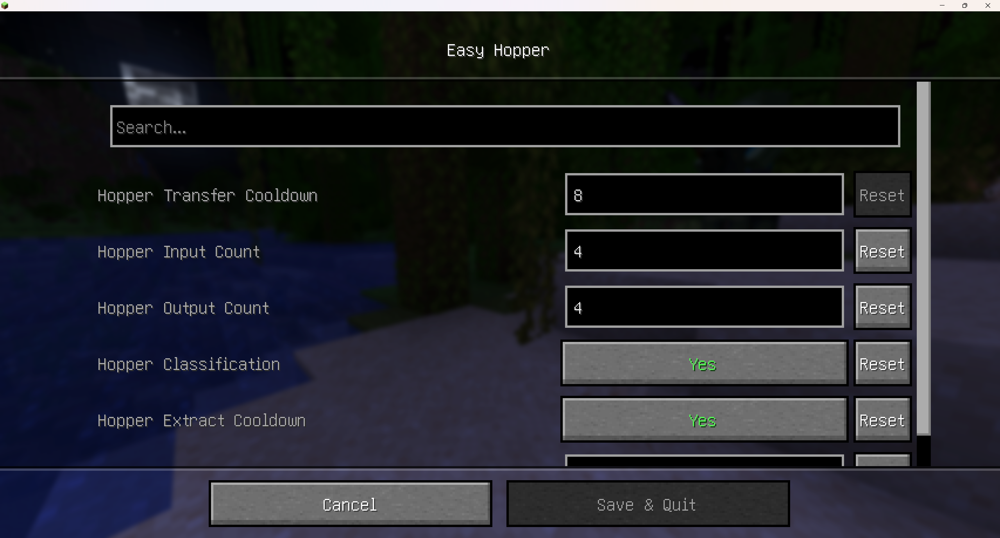

# EasyHopper

EasyHopper provides classification functionality based on the vanilla version, without introducing any additional
blocks.

## Dependencies

`modmenu` (client-side only)

** Warning **:
The configuration UI will only be displayed after installing `modmenu`. If EasyHopper is running on a server or
`modmenu` is not installed, you can only manually modify the configuration file in the `config` folder.

## Download

[Download from Modrinth](https://modrinth.com/mod/easy-hopper) (recommended)

[Download from CurseForge](https://www.curseforge.com/minecraft/mc-mods/easyhopper)

## Features

### Cooldown

After an input or output operation, hoppers enter a cooldown period, and the original cooldown time is 8 ticks (20 ticks
per second). This MOD provides the ability to modify the cooldown, you can adjust the cooldown as needed to increase
transfer speed.

### Input/Output Quantity

Modifying the number of items a hopper can input or output at once allows it to transfer more items in a single
operation. Note that dropped items are only affected by cooldown.

### Classification

After enabling the classification feature in settings, the last slot of hoppers will be used as the classification slot.
Only identical items (including non-stackable items, or tools with different damage) can be input or output.

If a player forcibly places different items, they will remain stuck in the hopper and cannot flow out until manually
removed by the player.

When the last slot of the hopper is empty, the hopper no longer classifies items. Even when empty, items cannot flow
into the last slot; it can only be filled manually by the player.

For example, if you place redstone in the last slot, only redstone can enter or leave this hopper. The moment you remove
the redstone, the hopper's classification function becomes inactive.

### Item Extract Cooldown

In vanilla Minecraft, hoppers check for dropped items every tick. This MOD adds a cooldown period to this process,
preventing frequent checks. It can significantly improve performance when many hoppers are present.

## Others

### Performance Enhancement (`<= 1.20.4`)

> In versions up to `1.20.4`, when a full block is above a hopper, there is almost no chance for dropped items to be
> input, yet hoppers still check items every tick. This MOD optimizes the code so that when a full block is above the
> hopper, it will not check for dropped items. This feature may cause extremely rare cases where dropped items embedded in
> full blocks cannot be sucked up by hoppers, such as honey dropping from beehives.

The official version has optimized the code in `1.20.5`, and the related functionality has been removed from this MOD.

### Conflicts with Other MODs

Since this MOD modifies hopper behavior, it may conflict with other MODs that also modify hopper behavior.