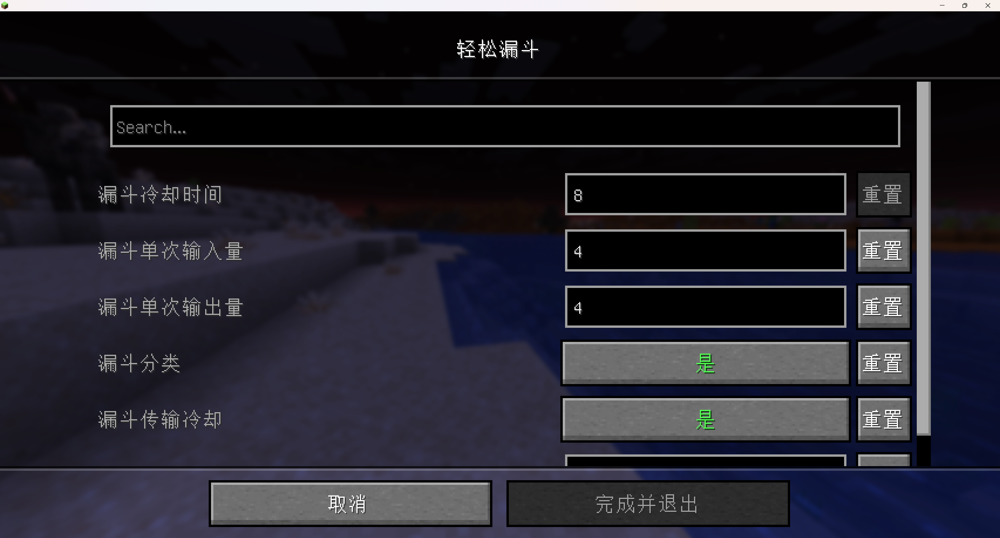

# EasyHopper

EasyHopper 在原版基础上提供分类功能, 而无需引入任何额外方块.

## 依赖

``modmenu`` (仅客户端)

**重要**:
仅在安装了 ``modmenu`` 后, 才会显示配置界面. 如果 MOD 在服务器上运行, 或未安装 ``modmenu``, 则只能前往 ``config``
文件夹中手动修改配置文件.

## 下载

[从Modrinth下载](https://modrinth.com/mod/easy-hopper) (推荐)

[从CurseForge下载](https://www.curseforge.com/minecraft/mc-mods/easyhopper)

[MC百科(不提供下载)](https://www.mcmod.cn/class/10443.html)

## 功能说明

### 冷却时间

漏斗在经过一次输入或输出后会进入冷却, 原版冷却时间为 8 tick (每秒20个tick). 本 MOD 提供了修改冷却时间的功能,
你可以根据需要调整冷却时间, 来提高传输速度.

### 输入输出数量

修改漏斗每次输入或输出数量, 使得漏斗单次可以输出或取走更多物品. 注意掉落物仅受冷却时间影响.

### 分类

在设置中开启分类功能后, 将会改用漏斗的最后一格为分类物品格, 只有相同的物品 (包括不可堆叠的物品, 或者不同磨损度的工具)
才可以输入或输出.

如果玩家强行放入不相同的物品, 则会**永远**在漏斗中无法流出, 直到玩家手动取走.

当漏斗的最后一格为空时, 该漏斗不再分类. 而即使为空, 物品也无法流入最后一格, 只能由玩家手动放置.

例如, 你在最后一格放入红石, 那么只有红石能进入或离开本漏斗. 当你取走红石的那一刻, 漏斗的分类功能会失效.

### 吸取凋落物冷却

原版漏斗在每个 tick 检测凋落物, 本 MOD 能够为其增加冷却时间, 避免频繁检测. 这在有大量漏斗时能够显著提升性能.

## 其他

### 性能增强 (``<= 1.20.4``)

> > 在 ``1.20.4`` 及以下版本中, 当漏斗上方为完整方块时, 几乎不存在凋落物输入情况, 而原版漏斗仍然会在每个 tick 检测一次.
> > 本 MOD 优化了相关代码, 当上方为完整方块时, 漏斗将不会检测掉落物. 该功能会导致极少数情况下, 凋落物嵌入完整方块时,
> > 无法被漏斗吸取, 例如蜂箱中掉落的蜂蜜.

官方已在 ``1.20.5`` 中优化了相关代码, 本 MOD 中相关功能已被移除.

### 与其他 MOD 冲突

由于本 MOD 修改了漏斗的行为, 与其他同样修改了漏斗行为的 MOD 可能会冲突. 
