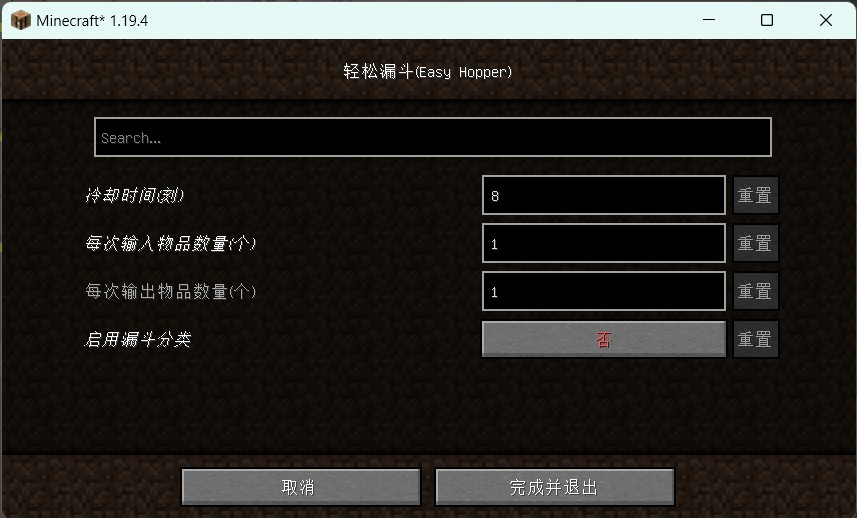

## EasyHopper

此MOD用于优化漏斗性能,并在原版基础上提供分类功能.

它在服务器上也能运行,但你需要前往``config``文件夹中手动修改配置文件.

## 依赖

``modmenu``(仅客户端)

**重要**:

如果此Mod被安装在客户端上,则你最好安装``modmenu``. 否则不会显示配置界面,你只能前往``config``文件夹中手动修改配置文件.

## 下载

[从CurseForge下载](https://www.curseforge.com/minecraft/mc-mods/easyhopper)

[MC百科(不提供下载)](https://www.mcmod.cn/class/10443.html)

## 功能说明

### 冷却时间

漏斗在经过一次输入或输出后会进入冷却,原版冷却时间是8(单位为tick,每秒20个tick).本mod提供了修改冷却时间的功能,如果漏斗较多(如500个),则可以增大冷却时间,以提高性能.

### 输入输出数量

每个漏斗会尝试先输出物品,再输入物品(如果你需要修改顺序,可以在issues里提出).修改漏斗每次输入或输出数量,使得漏斗单次可以输出或取走更多物品.注意掉落物仅受冷却时间影响.

### 分类

在设置中开启分类功能后,将会改用漏斗的最后一格为分类物品格,只有相同的物品(包括不可堆叠的物品,或者不同磨损度的工具)
才可以输入或输出,无论是掉落物,或是漏斗矿车.

如果玩家强行放入不相同的物品,则会**永远**在漏斗中无法流出,直到玩家手动取走.

当漏斗的最后一格为空时,该漏斗不再分类.而即使为空,物品也无法流入最后一格,只能由玩家手动放置.

例如,你在最后一格放入红石,那么只有红石能进入或离开本漏斗.当你取走红石的那一刻,漏斗的分类功能会失效.

### 性能增强

当漏斗不在工作时,会在每个tick尝试吸取上方掉落物,造成大量卡顿.性能增强包括以下两个方面:

1. 漏斗检测掉落物将会导致自己进入冷却,以避免频繁检测.

2. 漏斗上方为容器时,将会禁用掉落物检测,而是仅从容器内输入.

3. 漏斗上方为非容器的完整方块时,由于输入区域不可能存在掉落物,此时漏斗将会停止主动输入功能,但仍可以由其他漏斗输入(
   实际上也不可能主动输入).

4. 优化运输代码,减少引发的容器更新次数.

## 小技巧

### 漏斗链分类

使用漏斗链来代替水流分类.它在下届仍然奏效.你可以增大冷却时间和单次输入输出个数,来提升多漏斗时的性能(
实际上十几个漏斗并不会造成可见的性能降低).

以下是使用漏斗分类时的推荐配置.你可以根据自己需求修改.注意输入和输出数量最好相等,输入数量可以大于输出数量.

| 冷却时间 | 输入输出数量 | 远距离传输速度 |
|:----:|:------:|:-------:|
|  16  |   32   |    慢    |
|  8   |   16   |    中    |
|  4   |   8    |    快    |

除非你在用漏斗来远程传递物品,否则不建议把冷却时间设置为4或更低.冷却时间对性能的影响大于输入输出数量.

### 电路相关

你可能无法使用红石电路来精准控制漏斗内物品数量(大部分人用不到),因为红石的更新频率是2,且每次输入或输出物品数大于1.

### 计时器

如果你使用相向漏斗来计时,那么你需要根据你的具体配置,重新计算漏斗内物品数量.或者你可以根据计时要求,修改相关配置来更精准地计时.(1 tick = 0.05 s)

